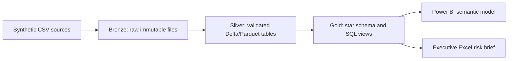

# Fabric Lakehouse-style architecture

Bronze retains raw extracts and ingestion metadata. Silver applies schema enforcement, null handling, transaction deduplication, date/type standardisation, referential checks, and balance reconciliation. Gold exposes conformed dimensions (`DimDate`, `DimCustomer`, `DimAccount`, `DimRiskBand`) and transaction, loan, and balance facts. In Fabric, use OneLake shortcuts/landing folders, Delta tables, a Warehouse or SQL analytics endpoint, and a deployment pipeline across development/test/production.

Grain is explicit: transaction fact = one posted transaction; loan snapshot = one loan per snapshot date; balance snapshot = one account per snapshot date. Customer and account are conformed dimensions. Monetary values are EUR, synthetic, and rounded to two decimals.
